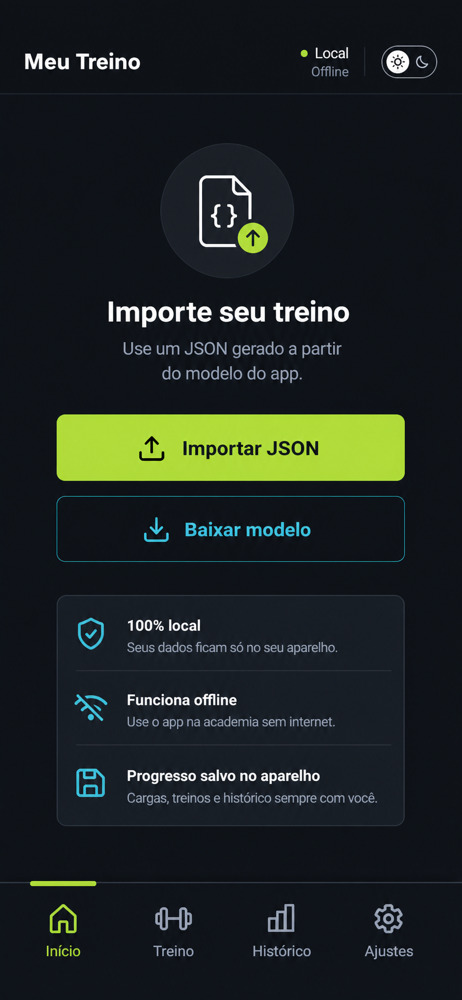
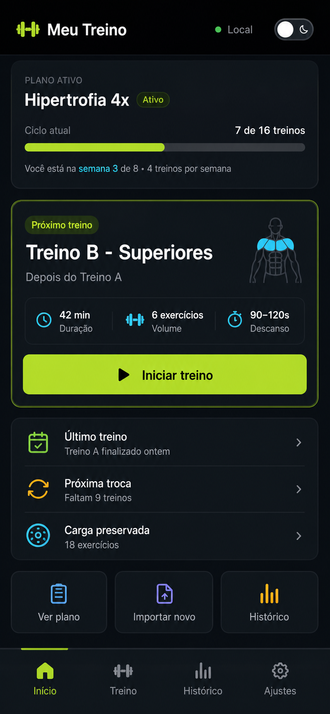
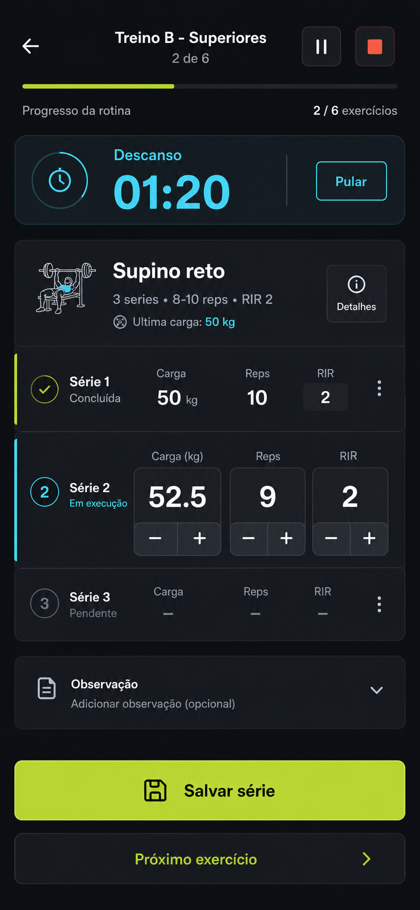

# UX e prototipo aprovado

Este documento organiza a fase de prototipacao visual do app `meu-treino` antes do inicio do desenvolvimento da interface.

Objetivo: validar fluxo, telas, estados e comportamento mobile antes de implementar, reduzindo retrabalho de layout e economizando tokens nas etapas de codigo.

## Decisao de usabilidade

A primeira versao deve seguir o modelo **Guiada**:

- A tela inicial abre direto no proximo treino recomendado.
- O usuario deve ter uma acao principal clara: iniciar o treino recomendado.
- A execucao do treino deve usar uma experiencia focada, parecida com o modelo **Modo Treino**, com timer, registro rapido de series e poucos elementos concorrendo por atencao.
- O plano completo e o historico ficam acessiveis, mas nao competem com a acao principal.

## Ferramenta recomendada

Usar **Excalidraw** para os wireframes e prototipos iniciais.

Razoes:

- E gratuito para o fluxo deste projeto.
- Funciona no navegador.
- E simples para desenhar e ajustar telas rapidamente.
- Evita gastar tempo cedo demais com detalhes visuais.
- E bom para validar fluxo, hierarquia, textos e componentes antes do codigo.
- Permite exportar imagens para anexar neste documento.

Ferramentas auxiliares:

- Imagens geradas pelo Codex: usar como referencia visual para redesenhar ou refinar no Excalidraw.
- Penpot: opcional no futuro, somente se precisarmos de um prototipo visual de alta fidelidade antes do desenvolvimento.
- Este documento: usar como contrato de aprovacao antes de desenvolver.

Arquivo editavel principal:

- `docs/prototipos/meu-treino-wireframes.excalidraw`

Versao atual:

- Contem os wireframes das telas `UX-01` a `UX-14`.
- Todas as telas foram organizadas em quadros mobile de 390 x 844 px.
- Arquivo auxiliar para regeneracao: `docs/prototipos/generate-wireframes.mjs`.

Como usar:

1. Acesse `https://excalidraw.com`.
2. Use `Open` ou arraste o arquivo `docs/prototipos/meu-treino-wireframes.excalidraw` para a tela.
3. Edite os quadros das telas.
4. Exporte cada tela aprovada como PNG.
5. Salve os PNGs em `docs/prototipos`.
6. Atualize o status da tela neste documento.

Regra importante: o Excalidraw valida estrutura e fluxo. A fidelidade visual final sera ajustada no desenvolvimento usando os tokens de tema.

## Processo de aprovacao

1. Definir mapa de telas.
2. Criar wireframes simples no Excalidraw.
3. Aprovar fluxo sem foco em beleza.
4. Aplicar identidade visual do modelo Guiada.
5. Exportar imagens das telas aprovadas para este documento.
6. Revisar em tamanho de celular.
7. Marcar telas como aprovadas neste documento.
8. So iniciar desenvolvimento visual depois da aprovacao das telas principais.

## Status possiveis

- `Pendente`: ainda nao foi desenhada.
- `Em desenho`: esta sendo criada no prototipo.
- `Em revisao`: precisa de avaliacao do usuario.
- `Aprovada com ajustes`: pode seguir, mas tem pequenos ajustes anotados.
- `Aprovada`: pode guiar desenvolvimento.

## Mapa de telas da primeira versao

| ID | Tela | Objetivo | Status |
| --- | --- | --- | --- |
| UX-01 | Inicio sem treino importado | Explicar estado vazio e levar para importar JSON ou baixar modelo | Aprovada |
| UX-02 | Inicio com treino ativo | Mostrar plano ativo, proximo treino recomendado, progresso do ciclo e botao iniciar | Aprovada |
| UX-03 | Detalhe do treino recomendado | Mostrar aquecimento, exercicios, cargas sugeridas e iniciar sessao | Aprovada |
| UX-04 | Execucao do treino | Registrar series, reps, carga, RIR e descanso integrado por card na propria tela | Aprovada |
| UX-05 | Descanso integrado na UX-04 | Nao criar tela separada; controlar descanso entre series dentro da UX-04 | Substituida pela UX-04 |
| UX-06 | Finalizacao do treino | Confirmar treino concluido, salvar ultima rotina e mostrar proxima recomendacao | Aprovada |
| UX-07 | Historico | Listar treinos concluidos e evolucao basica de carga | Aprovada |
| UX-08 | Detalhe de exercicio no historico | Mostrar ultima carga, maior carga e progresso por exercicio | Aprovada |
| UX-09 | Importar JSON | Selecionar arquivo local e validar estrutura | Aprovada |
| UX-10 | Preview do JSON importado | Mostrar resumo do plano e confirmar substituicao do treino atual | Aprovada |
| UX-11 | Erro de importacao | Explicar problema no JSON e orientar nova tentativa | Aprovada |
| UX-12 | Baixar modelo JSON | Permitir baixar ou compartilhar o arquivo modelo | Aprovada |
| UX-13 | Configuracoes | Trocar tema, exportar backup, apagar dados e ver versao | Aprovada |
| UX-14 | Tema claro | Validar a aparencia das telas principais no tema claro | Aprovada |

## Fluxos principais

### Primeiro uso

1. Usuario abre o app.
2. App mostra `Inicio sem treino importado`.
3. Usuario pode baixar modelo JSON.
4. Usuario importa um treino.
5. App valida e mostra preview.
6. Usuario confirma.
7. App mostra `Inicio com treino ativo`.

### Treino recomendado

1. Usuario abre o app.
2. App mostra proximo treino recomendado.
3. Usuario toca em `Iniciar treino`.
4. App abre detalhe/execucao da rotina.
5. Usuario registra series.
6. App salva cargas, reps e RIR.
7. Usuario finaliza treino.
8. App salva a ultima rotina finalizada.
9. App recomenda a proxima rotina pela ordem.

### Troca de treino

1. Usuario acessa importar JSON.
2. App valida novo plano.
3. App mostra preview.
4. Usuario confirma substituicao.
5. App descarta progresso da sequencia antiga.
6. App preserva historico de cargas de exercicios equivalentes.
7. App recomenda a primeira rotina do novo plano.

### Tema

1. Usuario acessa configuracoes.
2. Usuario alterna entre claro e escuro.
3. App aplica tema sem reiniciar.
4. Preferencia fica salva localmente.

## Componentes que precisam aparecer no prototipo

- Header compacto com nome do app, status offline/local e alternancia de tema quando fizer sentido.
- Card ou bloco principal de proximo treino recomendado.
- Barra de progresso do ciclo.
- Botao primario grande para iniciar treino.
- Lista compacta de exercicios.
- Registro de serie com carga, reps e RIR.
- Controles de incremento/decremento para carga e reps.
- Card de descanso dentro da execucao.
- Estado vazio para nenhum treino importado.
- Preview de importacao do JSON.
- Mensagem de erro de JSON invalido.
- Historico resumido de cargas.
- Configuracoes com tema claro/escuro.
- Navegacao inferior simples.

## Regras visuais para aprovar telas

- Mobile-first em 390 x 844 px.
- Tema escuro como padrao.
- Tema claro validado nas telas principais.
- Texto curto e legivel durante o treino.
- Botoes principais com area de toque grande.
- Numeros de carga, repeticoes e timer com destaque.
- Nada de landing page.
- Nada de excesso de cards empilhados.
- Sem texto cortado.
- Sem controles pequenos demais para uso na academia.
- Visual baseado no modelo 1 aprovado pelo usuario.

## Prompt base para gerar telas de referencia

Use este prompt quando quiser pedir ao Codex para gerar uma tela visual antes de desenhar ou refinar no Excalidraw:

```text
Use AGENTS.md, docs/arquitetura-prompt.md, docs/identidade-visual-opcoes.md e docs/ux-prototipo-aprovado.md como referencia.
Objetivo: gerar uma proposta visual para a tela [ID e nome da tela].
Direcao: seguir o modelo Guiada aprovado, mobile-first, tema escuro como padrao, com possibilidade de tema claro.
Restricoes: nao criar funcionalidades fora do escopo; nao fazer landing page; manter textos curtos; priorizar uso real durante treino.
Pronto quando: houver uma imagem da tela em 390 x 844 px e uma lista curta do que precisa ser aprovado.
```

## Prompt base para implementar tela aprovada

Use este prompt somente depois que a tela estiver aprovada:

```text
Use AGENTS.md, docs/arquitetura-prompt.md, docs/identidade-visual-opcoes.md e docs/ux-prototipo-aprovado.md como referencia.
Objetivo: implementar a tela [ID e nome da tela] conforme o prototipo aprovado.
Restricoes: manter React + Vite + TypeScript + Tailwind + shadcn/ui; usar tokens de tema; PWA primeiro; dados 100% locais.
Pronto quando: a tela estiver funcional, responsiva em mobile, coerente com o prototipo aprovado e verificada em viewport mobile.
```

## Registro de aprovacoes

Atualize esta tabela quando cada tela for aprovada.

| ID | Decisao | Observacoes | Data |
| --- | --- | --- | --- |
| UX-00 | Modelo Guiada escolhido como base | Combinar tela inicial do modelo 1 com execucao focada inspirada no modelo 3 | 2026-06-15 |
| UX-01..UX-14 | Todos os prototipos aprovados | Usar `docs/prototipos/meu-treino-wireframes.excalidraw` como guia de desenvolvimento das telas | 2026-06-15 |

## Prototipos aprovados

Os wireframes das telas `UX-01` a `UX-14` foram aprovados pelo usuario em 2026-06-15. A implementacao visual deve seguir o arquivo editavel `docs/prototipos/meu-treino-wireframes.excalidraw`, respeitando os tokens definidos em `docs/identidade-visual-opcoes.md`.

### UX-01 - Inicio sem treino importado



Pontos aprovados:

- A acao principal `Importar JSON` esta clara.
- A acao secundaria `Baixar modelo` aparece no momento certo.
- O estado vazio transmite que os dados ficam locais.
- Ajuste sugerido: trocar o status `Local Offline` por algo menos ambiguo, como `Dados locais` ou `Offline pronto`.

### UX-02 - Inicio com treino ativo



Pontos aprovados:

- O proximo treino recomendado esta claro.
- O botao `Iniciar treino` e a acao principal da tela.
- O progresso do ciclo esta facil de entender.
- Seguir com a composicao aprovada no wireframe do Excalidraw; elementos ilustrativos podem ser refinados no desenvolvimento sem mudar o fluxo.

### UX-04 - Execucao do treino



Pontos aprovados:

- O card de descanso esta visivel sem atrapalhar o registro.
- A serie atual tem destaque suficiente.
- Os controles de carga, reps e RIR parecem confortaveis para uso com uma mao.
- A navegacao inferior some durante o treino para reduzir distracao.
